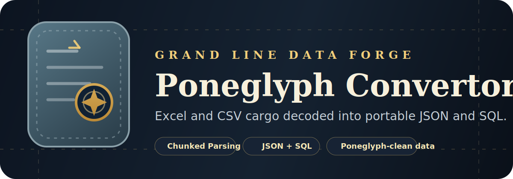

# Poneglyph Convertor

<p align="center">
  
</p>

<p align="center">
  A One Piece-inspired data conversion tool for turning CSV and Excel cargo into clean JSON or portable SQL.
</p>

<p align="center">
  <a href="https://github.com/hasnain-nisan">GitHub</a>
  |
  <a href="https://www.linkedin.com/in/hasnain-nisan1/">LinkedIn</a>
  |
  <a href="https://poneglyph-convertor.netlify.app/">Live Demo</a>
</p>

## Overview

Poneglyph Convertor is a Vite + React + TypeScript app built for practical spreadsheet conversion with a richer identity than a plain utility dashboard. It keeps large CSV files responsive with chunked parsing, supports Excel workbooks, cleans messy headers and leading apostrophes, and exports data as JSON or portable SQL that can be used across common database workflows.

The interface leans into a subtle One Piece / Poneglyph mood: stone-tablet surfaces, parchment highlights, compass accents, and a quiet treasure-map atmosphere that still feels professional and developer-friendly.

## Features

- Import `.csv`, `.xls`, and `.xlsx` files.
- Preview the detected columns and first rows before exporting.
- Convert data into clean `JSON` or portable `SQL`.
- Process large CSV files in chunks to reduce memory pressure.
- Normalize whitespace in headers automatically.
- Clean Excel-style leading apostrophes from values such as phone numbers and customer codes.
- Use a custom themed UI with loading states, summary cards, and export controls.

## Tech Stack

- Vite
- React
- TypeScript
- Tailwind CSS v4
- Papa Parse
- SheetJS (`xlsx`)
- Lucide React

## Project Structure

```text
src/
  components/
  constants/
  hooks/
  lib/
  types/
  App.tsx
  main.tsx
  styles.css
public/
  favicon.svg
  poneglyph-logo.svg
```

## Getting Started

```bash
npm install
npm run dev
```

Open the local Vite URL shown in the terminal to use the app.

## Live Demo

Explore the deployed app here:

https://poneglyph-convertor.netlify.app/

## Production Build

```bash
npm run build
npm run preview
```

## UX Highlights

- Ancient artifact-inspired hero section with a modern layout hierarchy.
- Branded dropdowns, upload panels, summary cards, and preview surfaces.
- Responsive design tuned for both desktop and mobile screens.
- Browser tab favicon aligned with the app's stone-and-gold identity.

## Branding

Crafted by **Hasnain Nisan**.

- GitHub: https://github.com/hasnain-nisan
- LinkedIn: https://www.linkedin.com/in/hasnain-nisan1/

## Notes

- SQL export is intentionally portable and database-friendly, using sanitized identifiers and text-based column definitions to reduce import friction across different SQL engines.
- The `xlsx` package is powerful but relatively heavy, so Vite may report a large bundle warning during production builds.
